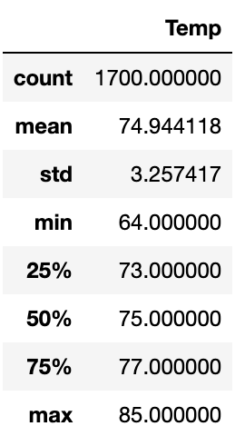
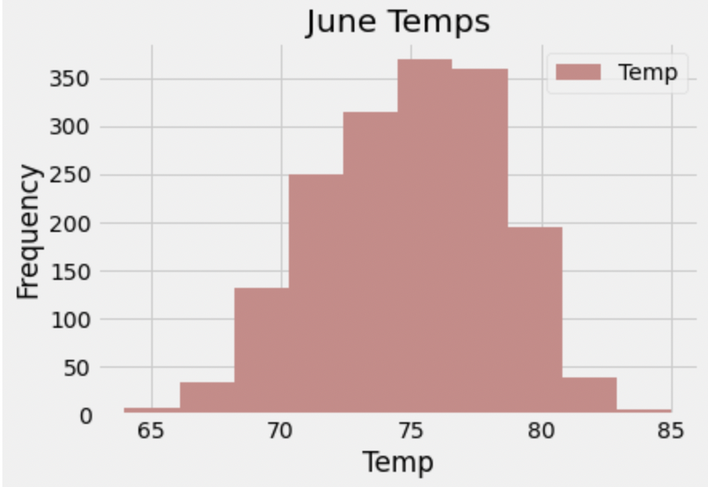
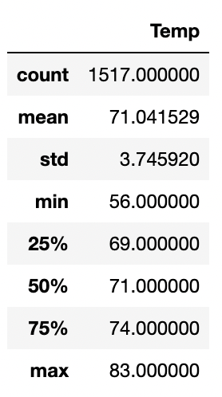
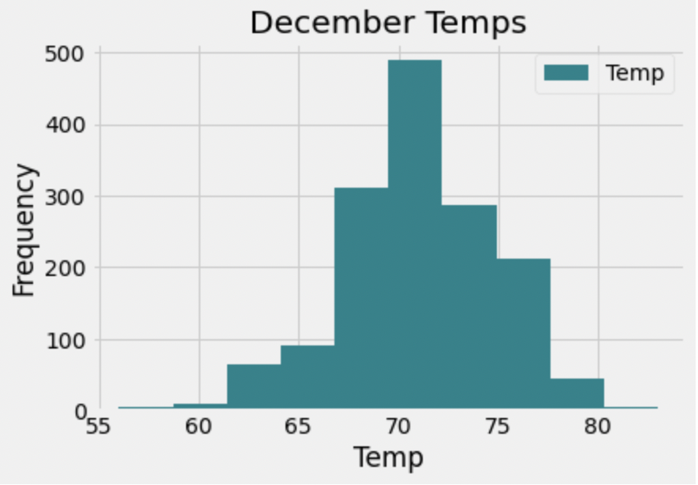

# surfs_up_challenge

## Overview
In this challege, I analyzed data for temperatures in June and December to determine if opening a surf and ice cream shop would be sustainable in Oahu, HI year-round. 

## Results
### Deliverable 1: Determine the Summary Statistics for June

* 1700 readings
* Avg Temp: 75°F
* Min Temp: 64°F
* Max Temp: 85°F

### Deliverable 2: Determine the Summary Statistics for December

* 1517 readings
* Avg Temp: 71°F
* Min Temp: 56°F
* Max Temp: 83°F

* Looking at the histogram, you can see that the minimum temp is very infrequent. 

### June and December Results 
* Average temperatures in June and December are in the 70s. 
* Comparing the histograms, you can see that the tempertures in both June and December have a good distribution around 70 degrees. 

## Summary
In conclusion, the results from this analysis show that the temperature in Oahu in June and December would support a sustainable surf and ice cream shop year-round. 

Two additonal queries for weather data:
* rain averages
* weather type (sunny, rainy, cloudy)

Additonal queries I would suggest:
* Monthly tourist analysis
